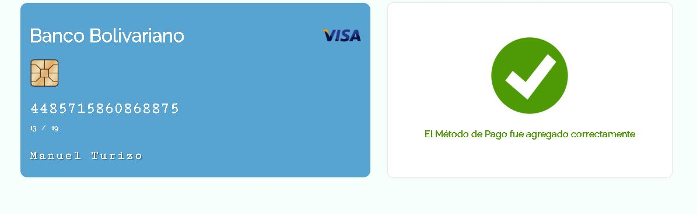

# Reto Coderos Componente Tarjeta con Svelte

Simular la funcionalidad de un módulo para agregar un nuevo método de pago, es decir una tarjeta de crédito o débito, dependiendo el número de tarjeta, el sistema detectará si se trata de una tarjeta VISA o Mastercard, además, en cuanto el sistema detecte el tipo de tarjeta, deberá cambiar el logo del tipo de tarjeta y la imagen de muestra de la tarjeta. Los datos de la tarjeta se actualizarán conforme se llene el formulario. 

Al hacer clic en agregar método de pago se deberán validar los campos y si están en orden se mostrará una nueva pantalla en donde se indique el mensaje el método de pago se agregó exitosamente.

El formulario deberá tener los siguientes campos:

- Número de la tarjeta
- Nombre del tarjetahabiente
- Fecha de expiración
- Código CVV
- Botón para guardar con el texto: “agregar método de pago"

El código terminado deberá subirse a:

- Un repositorio público (Github, Gitlab, Bitbucket,...)
- Publicarlo usando la infraestructura serveless Now  https://zeit.co/now

---

## Como utilizar este proyecto?

*Verifica que tengas instalado [Node.js](https://nodejs.org)

```bash
# Clona el repositorio
git clone direccion_to_remote_url.git creditCardRepo
# Mover al Directorio 
cd creditCardRepo
# Instalar las dependencias
npm install
# Corre el Servidor de Desarrollo
npm run dev
# Construye tu proyecto
npm run build
```

## Subir proyecto a Zeit

### Con [now](https://zeit.co/now)

Instala `now` si no lo tienes instalado

```bash
npm install -g now
```

Despúes muevete a tu proyecto y ejecuta el comando now

```bash
now
```


### Proyecto Final


Pantalla para añadir el método de pago


Pantalla donde se detecta el tipo de tarjeta de credito


Pantalla donde el método de pago fue agregado




### Autor

> Stalin Maza - Desarrollador Web y Móvil

